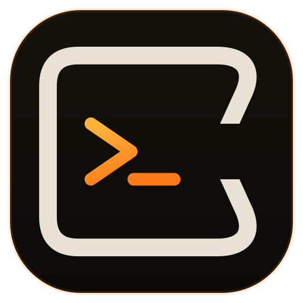

<div align="center">



# Uncaged

**The terminal you own. Bring your own AI — free, forever.**

Uncaged is an account-free, bring-your-own-model fork of the open-source
[Warp](https://github.com/warpdotdev/warp) terminal. Same terminal, same speed,
same look — with **no account, no subscription, and no data collection.** Power
its agentic Agent Mode with a model *you* control: a hosted API key, a local
model (Ollama, LM Studio, llama.cpp, vLLM), or a CLI agent you already run.

</div>

---

## Why it exists

Warp open-sourced its **client** under AGPL-3.0, but its premium agent runs on
Warp's servers, behind a login and a subscription — and that inference code isn't
in the open repo. Uncaged supplies the missing piece: a small **local agent
engine** ([`crates/uncaged_engine`](crates/uncaged_engine)) that drives Agent Mode
from a backend you choose, and removes the account/paywall gates. Nothing is sent
anywhere you didn't ask for.

The only outbound network traffic Uncaged makes is to the model endpoint **you**
configure. No accounts, no telemetry, no crash reporting, no cloud sync, no
auto-update phone-home — all off by design, and enforced in code on this build.

## What's different from Warp

- **No account.** The agent works the moment you connect a model — no sign-in, no Warp cloud in the loop.
- **No subscription.** Your model, your key or your local GPU. Zero Warp credits.
- **No data collection.** Telemetry, analytics, crash reporting, and cloud conversation storage are all off.
- **Your engine, your choice.** Hosted API, local model, or a CLI agent — swap any time.
- **Renamed and re-marked** off the Warp trademark; Warp's open-source visual design is kept.

## Connect a model

In the app, open **Settings → AI Models** and pick a platform from the gallery:

- **Run a model locally** — Ollama, LM Studio (one click).
- **Use a CLI agent** — Claude Code, Gemini, Codex CLI, over ACP (experimental).
- **Connect with an API key** — Anthropic, OpenAI, OpenRouter, Google, Groq, DeepSeek, Mistral, xAI, Together, or any OpenAI-compatible endpoint.

Or set it up from a terminal — same result, no rebuild needed:

```bash
./script/uncaged-setup     # pick a backend, paste a key or choose a local model
```

Either path writes `~/.uncaged/engine.json`, read live by the app. Saved
connections live in `~/.uncaged/connections.json`; everything stays on your
machine. See [UNCAGED.md](UNCAGED.md) for backends, the config schema, and
recommended local models.

## Install

**Download** — grab the latest `Uncaged.dmg` from the
[Releases](https://github.com/getuncaged/uncaged/releases) page, open it, and drag
Uncaged into Applications.

Because Uncaged is an independent fork without an Apple Developer ID, the app is
ad-hoc signed. On first launch macOS may say it's from an unidentified developer —
clear the quarantine flag once:

```bash
xattr -dr com.apple.quarantine /Applications/Uncaged.app
```

Coming from Warp? See [docs/migrate-from-warp.md](docs/migrate-from-warp.md) —
Uncaged is fully isolated from any Warp install (its own config dir and app
identity), so nothing is shared unless you choose to copy it over.

## Build from source (macOS)

```bash
# one-time: install full Xcode (App Store), then
sudo xcode-select -s /Applications/Xcode.app/Contents/Developer
sudo xcodebuild -license accept
xcodebuild -downloadComponent MetalToolchain     # Metal compiler for the UI

cargo run                                        # builds & launches Uncaged
./script/uncaged-setup                           # point it at your model
```

Uses the toolchain pinned in `rust-toolchain.toml`. To add an AI provider,
rebrand, or reskin, see [MODIFYING.md](MODIFYING.md). To produce a distributable
`.app` + `.dmg`, see [RELEASING.md](RELEASING.md). Full engineering guide (style,
tests, platform notes) is in [AGENTS.md](AGENTS.md).

## Licensing & attribution

- **AGPL-3.0.** Uncaged stays under the upstream client's license (see
  [`LICENSE-AGPL`](LICENSE-AGPL)); the `warpui` / `warpui_core` UI crates remain
  [MIT](LICENSE-MIT). If you distribute Uncaged, or run a modified version others
  use over a network, AGPL §13 requires you to offer them your complete
  corresponding source. Keep it open.
- **Trademark.** "Warp" and its logo are Warp's trademarks, which the AGPL does
  not grant. Uncaged is renamed and re-marked accordingly and is **not**
  affiliated with or endorsed by Warp.
- **Attribution.** Uncaged is a derivative of Warp by Denver Technologies, Inc.
  See [`NOTICE`](NOTICE). Upstream: <https://github.com/warpdotdev/warp>.

## Contributing

Contributions are welcome. Read [CONTRIBUTING.md](CONTRIBUTING.md) for the build
and PR flow, and [CODE_OF_CONDUCT.md](CODE_OF_CONDUCT.md). Security issues: see
[SECURITY.md](SECURITY.md). Questions and common issues:
[FAQ.md](FAQ.md).

## Built on open source

Uncaged inherits Warp's excellent foundation and the open-source projects it
builds on, including [Tokio](https://github.com/tokio-rs/tokio),
[NuShell](https://github.com/nushell/nushell),
[Alacritty](https://github.com/alacritty/alacritty),
[Hyper](https://github.com/hyperium/hyper),
[font-kit](https://github.com/servo/font-kit), and
[Smol](https://github.com/smol-rs/smol).
